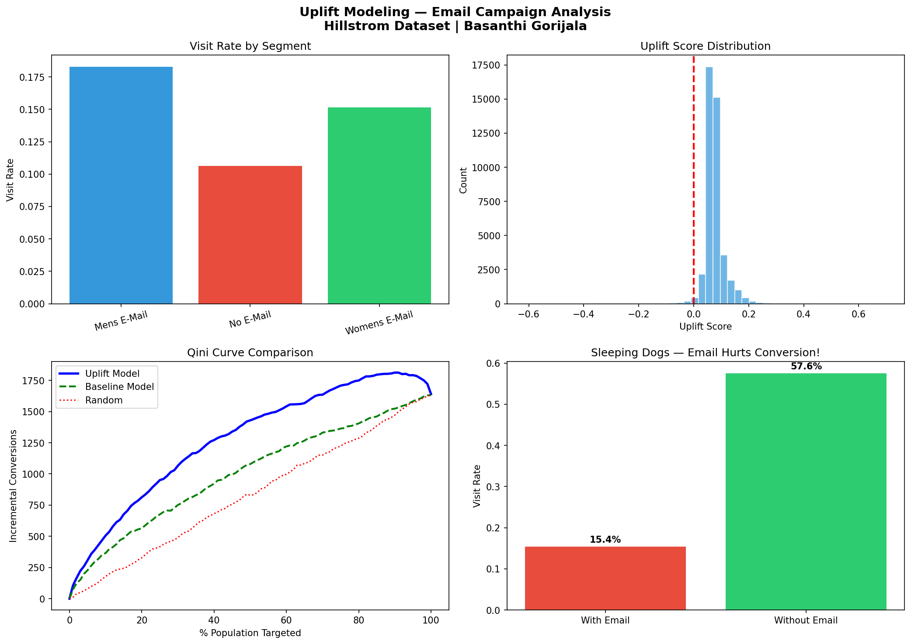
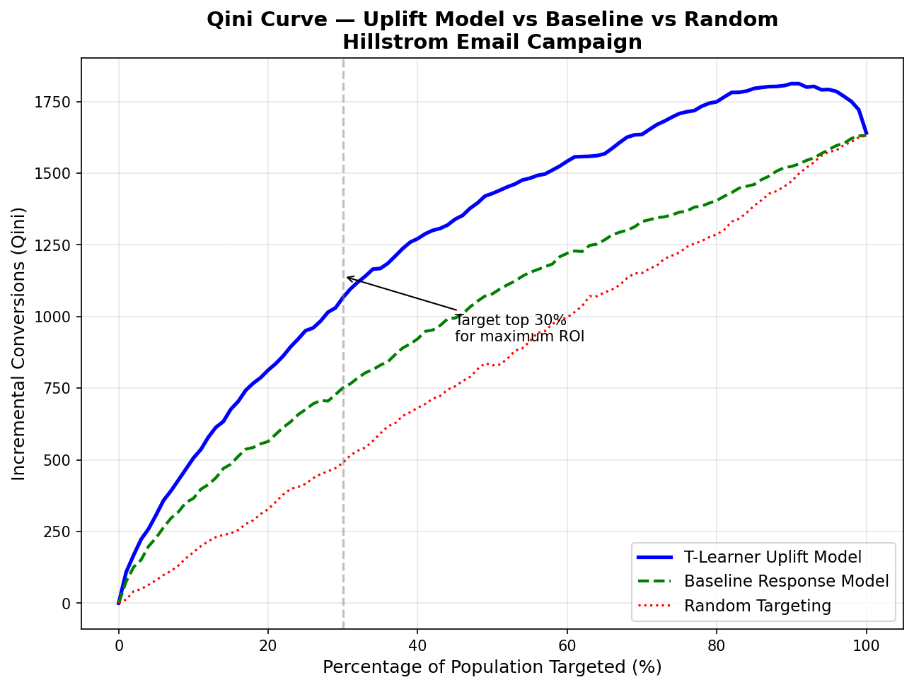

# uplift-modeling-email-campaign

# Uplift Modeling — Email Campaign Analysis
### Identifying WHO to Target, Not Just WHO Responds

**Author:** Basanthi Gorijala | [LinkedIn](https://linkedin.com/in/basanthi-gorijala)

---

## The Problem With Standard Response Models

Most marketing teams ask: *"Who is likely to convert?"*

The right question is: *"Who is likely to convert **because** of our campaign?"*

These are completely different questions — and confusing them wastes budget and can actively harm conversion.

---

## Key Findings

| Metric | Result |
|--------|--------|
| Dataset | 64,000 customers, 3-arm experiment |
| Uplift model vs random targeting | **+226% incremental visits** |
| Uplift model vs baseline model (Qini) | **+27.1% improvement** |
| Sleeping dogs identified | **504 customers** actively harmed by email |
| Sleeping dogs visit rate WITHOUT email | **57.6%** |
| Sleeping dogs visit rate WITH email | **15.4%** |

---

## The Sleeping Dogs Finding

The most important finding in this analysis:

504 customers (1.2% of the base) are **less likely to visit after receiving an email.**

Without email → 57.6% visit rate
With email → 15.4% visit rate

Emailing these customers actively destroys conversion. Standard response models would happily target them — because they look like high-value customers. Uplift modeling identifies and protects them.

---

## Project Structure
